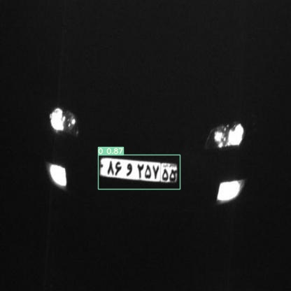

# Iranian License Plate Detection
  


Iranian License Plate Detection is an object detection project with the Yolov7 model (the Yolov5 is also trained) which is very precise on different types of license plates such as the colored background one or various occasions like the dirty cars. Due to the limitaion in Iranian license plate dataset, the model is trained by trasfer learinig with the biger forigen dataset. 
# Table of content
- [Dataset](/Iranian-license-plate-detection/edit/main/README.md#dataset)
 - Installation
 - Usage
 - Train your model!
 - Some results
 - License
  
 # Dataset
 The pretrained dataset :
 https://www.kaggle.com/datasets/andrewmvd/car-plate-detection
 # Installation
 # Usage
 First, you should adress the best.pt file and the Yolo directory to this part of the code
 
 ````python
 model = torch.hub.load('directory of yolo file', 'custom', 'best.pt', source='local')
 ````
 Then, adress the video or connected camera
 ````python
 cap = cv2.VideoCapture('video.mp4 or camera')  # input of video
 ````
 Now, the code is ready and you can run it. It will show you the video with license detection also you could find the cropped detected license plates and their annotaion files in license_plate and license_index directories. They will be used in reading the numbers of license plates.

 
 # Some results
     
 
# Source
- https://colab.research.google.com/drive/1X9A8odmK4k6l26NDviiT6dd6TgR-piOa
- https://github.com/WongKinYiu/yolov7

